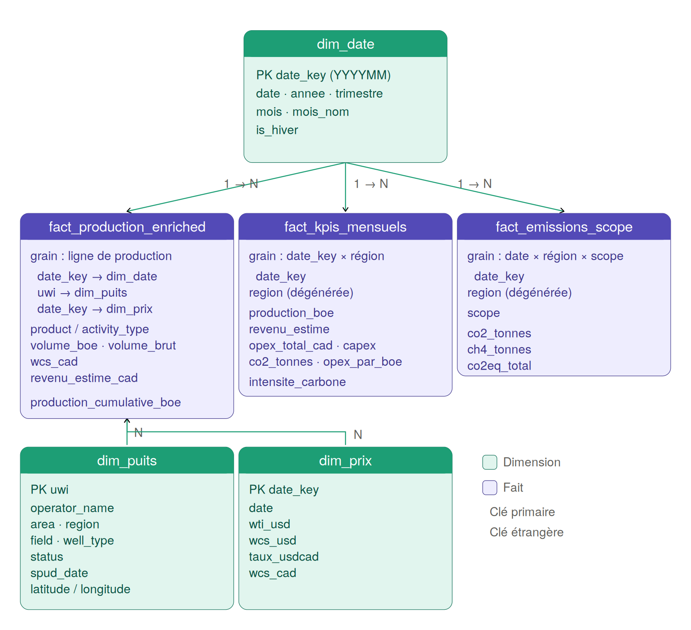
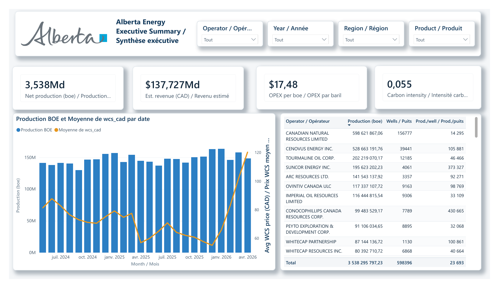
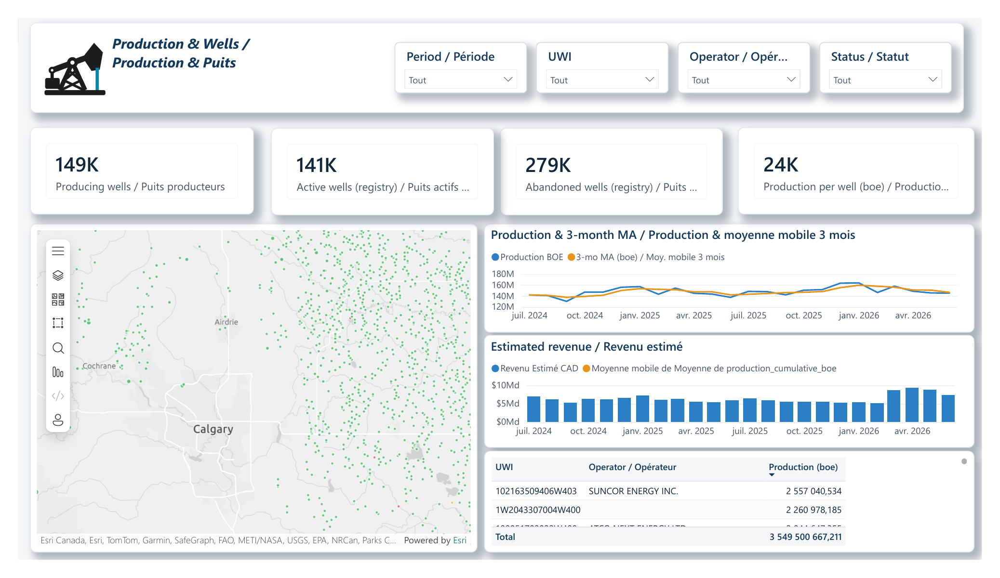
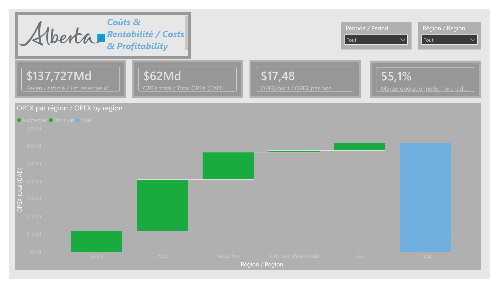
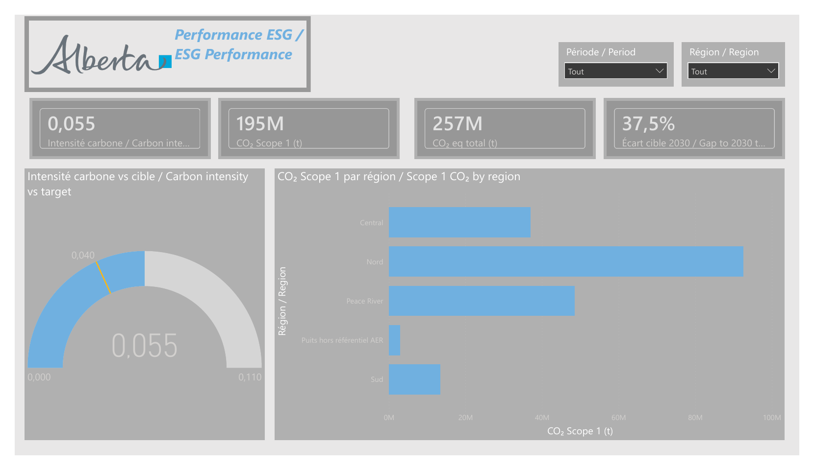
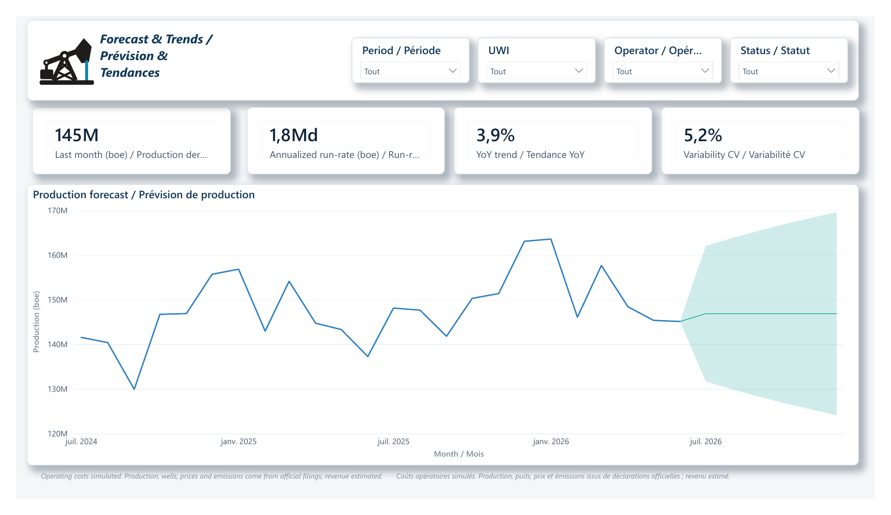

# Alberta Energy Operations Intelligence


Dashboard analytique end‑to‑end simulant le centre de pilotage d'une opération
**upstream Oil & Gas en Alberta**, à partir de **données réelles et publiques**
(AER / Petrinex) enrichies de modules financiers et ESG.

> 🚧 **Projet en cours de développement.** Le pipeline complet — ingestion, modèle en
> étoile, rapport — fonctionne de bout en bout et les chiffres présentés ci-dessous sont
> ceux du modèle actuel. Le projet continue d'évoluer : certains modules sont encore en
> cours d'affinage (voir §10) et les chiffres peuvent bouger d'une itération à l'autre.

---

## 1. Contexte métier

Calgary est le cœur du secteur énergétique canadien : la majorité des sièges sociaux
O&G et des postes de Data Analyst du domaine y sont concentrés. Ce projet reproduit
la chaîne analytique type d'un opérateur upstream — de l'ingestion réglementaire
brute jusqu'au tableau de bord exécutif.

Les **volumes de production** proviennent des déclarations mensuelles **Petrinex**
(24 mois glissants — mai 2024 à avril 2026, 7,18 M de lignes), géolocalisées via le
registre des puits **AER ST37**. Les volumes bruts sont convertis en **BOE** selon les
facteurs standard AER — le gaz est déclaré en **10³m³**, pas en m³, et exige donc un
facteur d'échelle supplémentaire. Seuls les liquides (OIL / COND) sont valorisés, au
prix **WCS** (Western Canadian Select) en dollars canadiens : aucun prix gaz (AECO)
n'entre dans le modèle.

Trois modules d'analyse sont superposés à la production : un module **financier**
(OPEX/CAPEX, OPEX par baril, marge), un module **ESG** (émissions Scope 1, intensité
carbone) et un module de **prévision**. L'ensemble alimente un modèle en étoile
exploité dans Power BI.

### Chiffres clés

| Indicateur | Valeur |
|---|---|
| Période couverte | 24 mois (2024-05 → 2026-04) |
| Puits au référentiel / producteurs | 598 396 / 149 340 |
| Production | 3,54 Md boe |
| Revenu estimé (liquides) | 137,7 Md $ CA |
| OPEX / OPEX par boe | 61,8 Md $ CA / **17,48 $** |
| Marge opératoire | **55,1 %** |
| CO₂ Scope 1 / intensité | 194,6 Mt / **0,0550 tCO₂/boe** |

> Les valeurs de production, de prix et de localisation sont **réelles** ; les coûts et
> les émissions sont **simulés** à partir de ces volumes (cf. §3).

---

## 2. Architecture

```
                Sources publiques
  ┌────────────┬──────────────┬─────────────────┬───────────────┐
  │ Petrinex   │  AER ST37    │ Petrinex réf.   │ Yahoo Finance │
  │ Volumetric │  Well List   │ (BA / Field)    │ + Bank of Can.│
  └─────┬──────┴──────┬───────┴────────┬────────┴──────┬────────┘
        │             │                │               │
        ▼             ▼                ▼               ▼
 ┌──────────────────────────────────────────────────────────────┐
 │  Python (scripts 01–05) → Parquet dans data/processed/        │
 │  pandas · numpy · requests · pyarrow                          │
 └───────────────────────────┬──────────────────────────────────┘
                             ▼
 ┌──────────────────────────────────────────────────────────────┐
 │  dbt Core + DuckDB   (staging → marts, tests, lineage)        │
 │  data/energy.duckdb                                           │
 └───────────────────────────┬──────────────────────────────────┘
                             ▼
 ┌──────────────────────────────────────────────────────────────┐
 │  Power BI Desktop — PBIP  (étoile · 27 mesures DAX · RLS)     │
 └──────────────────────────────────────────────────────────────┘
```

---

## 3. Sources de données

| Source | Contenu | Format | URL |
|---|---|---|---|
| **Petrinex – Conventional Volumetrics** | Production mensuelle AB (24 mois) | ZIP→CSV | `petrinex.gov.ab.ca/publicdata/API/Files/AB/Vol/{YYYY-MM}/CSV` |
| **AER ST37 – List of Wells** | Registre des puits (localisation DLS, statut, licence) | ZIP→TXT | `static.aer.ca/prd/documents/sts/st37/ST37.zip` |
| **Petrinex – Business Associate** | Codes BA → noms d'opérateurs | CSV | `petrinex.gov.ab.ca/bbreports/PRABAIdentifiers.csv` |
| **Petrinex – Field Codes** | Codes champ → noms de champs | CSV | `petrinex.gov.ab.ca/bbreports/PRAFieldCodes.csv` |
| **Yahoo Finance – WTI (CL=F)** | Prix WTI mensuel (base WCS) | JSON | `query1.finance.yahoo.com/v8/finance/chart/CL=F` |
| **Banque du Canada – FXUSDCAD** | Taux de change USD/CAD mensuel | JSON | `bankofcanada.ca/valet/observations/FXUSDCAD/json` |

> Les modules **coûts** (OPEX/CAPEX) et **émissions** sont **simulés** à partir des
> volumes réels, avec des fourchettes calées sur l'*AER Annual Report 2023* et les
> facteurs du *NIR 2024* (documenté dans `scripts/04` et `scripts/05`).

---

## 4. Pipeline Python (`scripts/`)

| Script | Sortie | Rôle |
|---|---|---|
| `01_ingest_petrinex.py` | `petrinex24.parquet` / `.csv` | Téléchargement parallèle, double dézip, nettoyage, conversion BOE |
| `02_ingest_aer_wells.py` | `dim_puits.parquet` | Parsing ST37, reconstruction UWI, **conversion DLS→lat/lon**, jointures BA/Field |
| `03_ingest_prices.py` | `dim_prix.parquet` | WTI (Yahoo) + USD/CAD (BoC) → WCS CAD mensuel |
| `04_generate_costs.py` | `fact_couts.parquet` | OPEX/CAPEX simulés (saisonnalité hiver, incidents) |
| `05_generate_emissions.py` | `fact_emissions.parquet` | CO₂/CH₄/CO₂eq Scope 1 (facteurs NIR 2024) |

`production_universe.py` définit le **périmètre canonique** partagé par 04 et 05 :
correctif d'unité gaz (Petrinex déclare en 10³m³) et filtre production commercialisée
(`PROD`, hors `WATER`), identiques à ceux du mart dbt. Les ratios du dashboard divisent
un numérateur simulé par un dénominateur issu du mart : si les deux côtés ne filtrent
pas à l'identique, le ratio est faux sans qu'aucun test ne se déclenche.

**Résultats validés** : couverture UWI ST37 ↔ Petrinex **99,0 %** (1 426 puits
producteurs hors référentiel sur 149 340) · OPEX/boe médian **16,70 $** (cible 8–30)
· intensité carbone **0,0550 tCO₂/boe** (facteur NIR 0,055).

---

## 5. Modèle de données (dbt → DuckDB)

Schéma en étoile, matérialisé dans `data/energy.duckdb` :

- **Staging** (vues) : `stg_petrinex_production`, `stg_aer_wells`, `stg_eia_prices`,
  `stg_costs`, `stg_emissions`
- **Marts** (tables) : `dim_date`, `dim_puits`, `dim_region`,
  `fact_production_enriched`, `fact_kpis_mensuels`, `fact_emissions_scope`



> Le diagramme est **en retard de deux évolutions** : `dim_region` (dimension conforme,
> décrite plus bas) n'y figure pas encore, et `fact_production_enriched` porte désormais
> aussi `opex_cad` et `co2_tonnes`. Le reste — grains, clés et cardinalités — est à jour.

`dim_region` est la **dimension conforme** : `dim_puits` et `fact_kpis_mensuels` ne sont
pas reliés entre eux, donc un slicer posé sur la colonne d'un fait ne filtrerait que ce
fait. Les pages filtrent `dim_region[region]`, qui atteint les deux branches.

`fact_production_enriched` (4 342 506 lignes, grain puits × mois × produit) porte le
volume, le revenu, **l'OPEX et le CO₂** — ces deux derniers répartis au prorata du
volume depuis la simulation (puits × mois). La répartition est exacte : les scripts
calculent `opex = taux × volume` et `co₂ = facteur × volume` à taux et facteur constants
sur un couple (puits, mois). C'est ce grain fin qui rend l'OPEX et l'intensité carbone
filtrables par opérateur, statut, puits et type de produit.

`dbt build` → **38 PASS / 1 WARN / 0 ERROR** sur 39 nœuds (tests `not_null`, `unique`,
`accepted_values`, `relationships`). Le WARN est un test de relation à 24 lignes : 1 UWI
producteur absent de `dim_puits` après déduplication insensible à la casse — sans effet
côté Power BI, qui apparie les clés en insensible à la casse.
📚 Lineage complet : [`docs/dbt/index.html`](docs/dbt/index.html).

---

## 6. Mesures DAX (extraits)

```dax
OPEX par boe =                          -- métrique phare O&G
DIVIDE ( [OPEX Total CAD], [Production BOE] )

OPEX Total CAD =                        -- grain puits × mois × produit
SUM ( fact_production_enriched[opex_cad] )

Intensité carbone =                     -- ESG : tCO₂ / boe
DIVIDE ( [CO2 Scope 1 (t)], [Production BOE] )

Marge Opérationnelle % =                -- opex-only, PAS une marge nette
DIVIDE ( [Revenu Estimé CAD] - [OPEX Total CAD], [Revenu Estimé CAD] )

Tendance YoY % =                        -- 12 derniers mois vs 12 précédents
DIVIDE ( [Production 12 derniers mois] - [Production 12 mois précédents],
         [Production 12 mois précédents] )
```

**27 mesures** organisées en 5 dossiers d'affichage (Production, Finance, ESG, Time
Intelligence, Puits), plus une mesure rapide de moyenne mobile. **RLS 3 rôles**
(Nord / Sud / Admin), appliquée sur `dim_puits`, `fact_kpis_mensuels`,
`fact_emissions_scope` et `dim_region`.

Chaque ratio prend son numérateur et son dénominateur **sur le même fait**, pour rester
juste sous n'importe quel filtre. Un ratio dont les deux termes vivent à des grains
différents se fige silencieusement dès qu'on pose un slicer que l'un des deux n'atteint
pas — c'est le principal piège de ce modèle, et la raison du grain retenu au §5.

> La marge est **opératoire** (hors redevances, transport et G&A, indisponibles par
> puits) : à ne pas lire comme une rentabilité nette.

---

## 7. Le rapport Power BI

Cinq pages, un slicer région conforme (`dim_region`) partagé, et une RLS à 3 rôles.

### P1 — Synthèse exécutive / Executive Summary



Les quatre KPI de tête — production nette, revenu estimé, OPEX par baril, intensité
carbone — au-dessus d'un combiné production / prix WCS mensuel et d'un classement des
puits par opérateur. Slicers : opérateur, année, région, type de produit.

### P2 — Production & Puits / Production & Wells



Carte ArcGIS des puits géolocalisés (lat/lon reconstruites depuis le DLS, cf. §9),
compteurs de puits producteurs / actifs / abandonnés, production mensuelle avec sa
moyenne mobile 3 mois, et le détail par UWI. Slicers : période, UWI, opérateur, statut.

> Cette capture est filtrée sur **2025** (slicer Période) : les totaux affichés portent
> sur l'année, pas sur les 24 mois. Les quatre autres pages sont non filtrées.

### P3 — Coûts & Rentabilité / Costs & Profitability



Revenu, OPEX total, OPEX par baril et marge opératoire, au-dessus d'un waterfall de
l'OPEX par région. L'OPEX/boe se tient autour de 17,4–17,6 $ dans les cinq régions :
c'est le résultat attendu d'une simulation à taux constant, et l'indicateur qu'aucun
biais d'unité ne subsiste entre le numérateur et le dénominateur (cf. §4).

### P4 — Performance ESG / ESG Performance



CO₂ Scope 1 et CO₂eq (CH₄ × 28, GWP100 AR6), intensité carbone, et une jauge situant
l'intensité face à la cible Alberta 2030 de 0,040 tCO₂/boe — soit un écart de +37,5 %.

### P5 — Prévision & Tendances / Forecast & Trends



Prévision native Power BI à 6 mois (intervalle de confiance 95 %) sur la production
mensuelle, encadrée par la production du dernier mois, le run-rate annualisé, la
tendance YoY et la variabilité (coefficient de variation).

> Captures exportées depuis Power BI Desktop en PDF puis converties en PNG (1 660 px).
> Procédure et conventions de nommage : [`docs/screenshots/README.md`](docs/screenshots/README.md).

---

## 8. Reproduire le projet

```powershell
# 1. Environnement
python -m venv .venv
.\.venv\Scripts\Activate.ps1
pip install -r requirements.txt

# 2. Données brutes manuelles dans data/raw/ :
#    ST37.zip, ba_codes.csv, field_codes.csv  (URLs section 3)

# 3. Pipeline Python
python scripts\01_ingest_petrinex.py
python scripts\02_ingest_aer_wells.py
python scripts\03_ingest_prices.py
python scripts\04_generate_costs.py
python scripts\05_generate_emissions.py

# 4. Transformation dbt
cd dbt_project\energy_analytics
dbt build --profiles-dir .
dbt docs generate --profiles-dir .

# 5. Ouvrir le dossier reporting\ dans Power BI Desktop, puis Actualiser
```

> `01_ingest_petrinex.py` télécharge ~13 M de lignes brutes ; les autres scripts
> lisent les Parquet produits en amont. Voir `scripts/0X_*.py` pour les paramètres.

**`profiles.yml` n'est pas versionné** (il contient un chemin machine). En créer un dans
`dbt_project/energy_analytics/` :

```yaml
energy_analytics:
  target: dev
  outputs:
    dev:
      type: duckdb
      path: "../../data/energy.duckdb"
      threads: 4
```

Les vues de staging lisent les Parquet en **chemin relatif** (`../../data/processed/`) :
lancer dbt — et toute requête DuckDB sur `stg_*` — depuis `dbt_project/energy_analytics`.
Les marts, eux, sont matérialisés en tables, donc Power BI n'est pas concerné.

Le rapport est un projet **PBIP** (`reporting/`), pas un `.pbix` : le modèle sémantique
et les visuels sont stockés en TMDL et JSON, donc lisibles et diffables en revue de code.
Le chemin de la base est **codé en dur** dans les partitions M du modèle sémantique — à
adapter après un clone.

---

## 9. Écarts assumés vs spécification initiale

- **ST37** : publié en TXT tabulé (pas Excel), sans lat/lon ni noms → coordonnées
  **converties depuis le DLS**, noms restitués via les référentiels Petrinex.
- **Prix** : EIA + Alpha Vantage exigent des clés API → remplacés par **Yahoo
  Finance + Banque du Canada** (keyless), WCS = WTI − 17,5 $ conservé.
- **Gaz non valorisé** : le WCS est un benchmark pétrole lourd. Faute de prix AECO, le
  gaz compte dans les volumes et les émissions mais pas dans le revenu — le valoriser au
  prix du pétrole l'aurait surestimé d'un facteur 4 à 5. La marge est donc calculée sur
  un revenu liquides-only, ce qui la rend **conservatrice**.
- **Périmètre de production** : seule la production commercialisée est retenue (`PROD`,
  hors `WATER`) — le gaz combustible (`FUEL`), torché ou évacué (`VENT`) et les puits
  fermés (`SHUTIN`) sont exclus. Coûts, émissions et production partagent ce périmètre
  via `scripts/production_universe.py` ; c'est une contrainte du modèle, pas un détail
  d'implémentation, puisque les ratios croisent numérateur simulé et dénominateur réel.
- **1 426 puits producteurs hors référentiel AER** (~1 % de la production) : présents
  dans Petrinex, absents de l'extrait ST37. Rattachés à un bucket explicite plutôt que
  masqués, pour que les totaux restent justes et l'écart visible.
- **CAPEX indicatif** : simulé en log-normale, il sert à illustrer la structure de coûts
  et n'est **pas calé** sur les coûts de forage réels albertains — à ne pas citer comme
  un ordre de grandeur.

---

## 10. État d'avancement

Le pipeline tourne de bout en bout et le rapport est exploitable. Ce qui reste ouvert :

**En cours d'affinage**

- **CAPEX** — simulé en log-normale, l'ordre de grandeur (~33 k$/puits) est loin des
  coûts de forage albertains réels (2–8 M$). À recalibrer, puis à exposer sur la page
  Coûts, qui n'affiche aujourd'hui que de l'OPEX.
- **Garde-fous dbt** — ajouter des tests de cohérence sur les ratios (OPEX/boe dans la
  bande 8–30, intensité carbone autour de 0,055) et sur l'alignement des périmètres
  entre coûts, émissions et production. Deux régressions passées seraient passées au
  travers des tests actuels, qui ne vérifient que structure et intégrité référentielle.
- **Fraîcheur des données** — le jeu courant s'arrête à avril 2026 ; le rafraîchissement
  n'est pas encore automatisé (`airflow_dags/` est un emplacement réservé, pas un DAG).

**Limites connues**

- Les slicers UWI des pages Production et Prévision exposent ~598 k valeurs : peu
  maniable, à remplacer par une recherche ou un filtre hiérarchique.
- 1 test dbt en avertissement (24 lignes) : 1 UWI producteur absent de `dim_puits` après
  déduplication insensible à la casse. Sans effet côté Power BI.
- Le rapport n'est pas encore publié (Publish to Web) : les captures du §7 sont la seule
  restitution disponible en ligne.

---

*Projet portfolio Data Analyst — Calgary 2026.*
