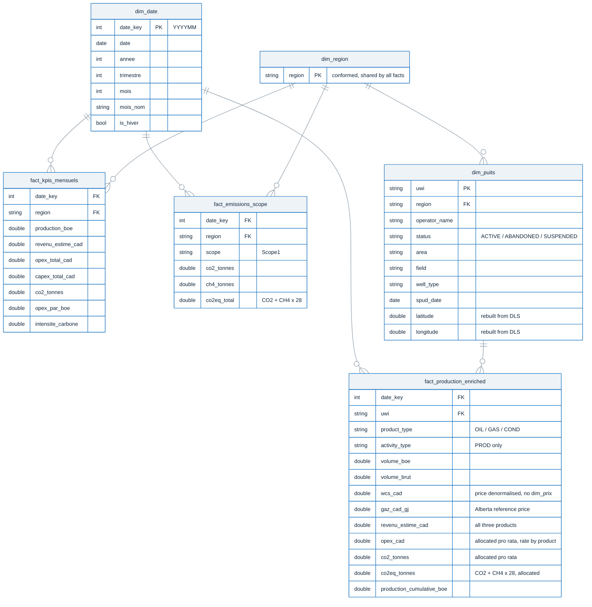

# Alberta Energy Operations Intelligence

End-to-end analytics on Alberta's oil and gas basin, built entirely from public
regulatory data: Petrinex production filings and the AER well register, ingested,
modelled into a star schema, and reported in Power BI.

| | | |
|---|---|---|
| **3.55 Bn boe** produced | **599,275** wells on the register | **3,016** operators |
| **24 months** of filings | **148,693** producing wells | **4.34M** fact rows |
| **CAD 167.3 Bn** revenue | **$14.60** OPEX per barrel | **91.2 Mt** Scope 1 CO₂ |

Production volumes, prices and well locations are real. Emissions are computed from the
fuel, vent and flare volumes operators declare to Petrinex, using NIR annex 6 and AER
Directive 060 factors — no random draws. Only operating costs are simulated. Full
assumptions in [`docs/ARCHITECTURE.md`](docs/ARCHITECTURE.md#assumed-trade-offs).

---

## The problem worth talking about

The pipeline produced credible numbers and 39 dbt tests were green. Two of those numbers
were wrong, and finding out why is the part of this project I'd defend hardest.

OPEX per barrel ranged from **$4.03 to $14.52** across regions. That looks like a real
difference in cost structure. It wasn't. Lined up against gas share:

| Region | Gas share | OPEX/boe |
|---|---|---|
| Nord | 16.9 % | $14.52 |
| Peace River | 76.7 % | $4.08 |
| Central | 76.9 % | $4.03 |

A near-perfect inverse relationship, and the magnitude gave it away. Gas genuinely is
cheaper to operate per barrel of oil equivalent, so *some* inverse slope is expected —
but not this one. **$4.03/boe is below any credible operating floor**: no Alberta
producer lifts, compresses, dehydrates and ships a barrel equivalent for four dollars.
The global figure was $9.21, comfortably inside any sane band, which is exactly why a
test on the total saw nothing.

The cause was a unit error. Petrinex reports gas in 10³m³, not m³, and the rescaling
existed in the production branch of the pipeline but not the cost branch. Numerator and
denominator were in different units, so the more gas a region produced, the more its
OPEX/boe was diluted.

After that fix, and after giving each product its own operating rate, OPEX/boe sits
between **$10.05 and $19.22** across the five regions — still an inverse function of gas
share, but now the *legitimate* one, ~$6/boe for gas against ~$20 for liquids.

The second bug had the same shape. Emissions were generated for every Petrinex record,
while the production mart excludes fuel gas, flared and vented volumes, and shut-in
wells. Nobody reconciled the two scopes, so **11,943 wells carried 16.1 Mt of CO₂ with
no production underneath them**, pushing carbon intensity from 0.0551 to 0.0597.

**The fix and the net.** Both bugs were one scope rule applied in one branch and not its
siblings, so the definition now lives in a single module imported by both generators.
Then four plausibility tests, because nothing structural could have caught either one:
the tables were valid, the keys present, referential integrity intact.

The grain is the whole trick. While the bug was live the **global** OPEX/boe was $9.21,
comfortably inside any sane band. A test on the total would have passed. Only the split
exposed it. Replayed against a pre-fix copy of the database, the tests return **3 regions
out of band, 1 on intensity, and 413,760 orphaned (well, month) pairs**.

That lesson has since been applied twice more. The OPEX test now checks **per product**
rather than per region, because differentiating operating rates by product made regional
variation legitimate — a regional band would now reject a correct result. And a new test
asserts that every product carrying volume also carries revenue, after gas spent months
priced at zero: 47% of the barrels, no revenue, and not one structural test could see it
because the tables were valid and the total stayed plausible.

---

## The report

Five pages, one conformed region slicer, row-level security on three roles.

### Production and wells

Every producing well in the province, geolocated from coordinates rebuilt out of the
Dominion Land Survey, since ST37 ships without lat/lon.

### Costs and profitability

OPEX waterfall by region. The first thing I check is whether the spread tracks gas share
and nothing else: $10.05/boe in Central at 76.9% gas, $19.22 in Nord at 17.1%. Anything
outside that relationship means the cost branch and the production branch have drifted
apart again, which is exactly how the unit bug surfaced.

### ESG performance

Scope 1 CO₂ and CO₂e against Alberta's 2030 intensity target, sitting 35.8% below it. The
conversion is checkable by hand: 91.2 + 0.261 × 28 = 98.5 Mt.

That check only works because both cards now read the same fact. They used not to: CO₂e
came from the emissions fact and Scope 1 from the production fact after allocation, so
the 5.0 Mt declared by installations with no producing well underneath them showed up as
a gap between the two cards and read like methane. A test now pins the ratio.

### Forecast and trends

Six-month forecast at 95% confidence, with year-over-year trend at +3.9% and a
coefficient of variation of 5.2%.

---

## How it's built

**Ingestion.** ST37 arrives as tab-delimited text with no coordinates and no operator
names, so the hard part is UWI reconstruction, a DLS to lat/lon conversion, and joins
back to the Petrinex reference files. **99.0% coverage** against the production data.

**Modelling.** dbt Core on DuckDB. Three facts, three dimensions, and a conformed
`dim_region` that all three facts share. Without it a region slicer filters one fact and
silently leaves the others alone.

Grain is written down per table. `fact_production_enriched` sits at well by month by
product, 4.34M rows, and carries OPEX and CO₂ allocated pro rata by volume. That is what
lets those two measures respond to an operator or product filter, which they could not
do while they lived on the month-by-region aggregate.

**Reporting.** 27 DAX measures, RLS across three roles, saved as a **PBIP project rather
than a .pbix**: the model is TMDL and the visuals are JSON, so the whole report is
reviewable in a diff instead of by opening Power BI and clicking around.

Every ratio takes numerator and denominator from the same fact. A ratio spanning two
grains freezes the moment someone applies a slicer only one side can see, and it doesn't
look broken while it does it.

Setup, sources, model detail, DAX and assumptions: [`docs/ARCHITECTURE.md`](docs/ARCHITECTURE.md),
which also covers who owns the source data and what you may do with it.

The dbt catalogue is committed under `docs/dbt/`. GitHub serves those files as source
rather than as a rendered page, so open `docs/dbt/index.html` from a local clone, or
regenerate it with `dbt docs generate && dbt docs serve` from `dbt_project/energy_analytics`.

---

## What I'd do next

The **inactive well inventory** is the piece I want most. 450,583 wells on the register
have no production — 75% of it — and 278,554 of those are already abandoned. Reclamation
liability is a live financial and political issue in Alberta, the data is already in the
model, and it's the one genuinely non-simulated finding here that I haven't used.

CAPEX needs recalibrating: it lands near $33k per well against a real $2 to 8 million,
and it isn't surfaced anywhere yet. Data stops at June 2026 and refresh isn't
automated. Two pages still expose UWI slicers with 599k values, which needs a search
control instead.

---

Data Analyst portfolio project, Calgary 2026.
