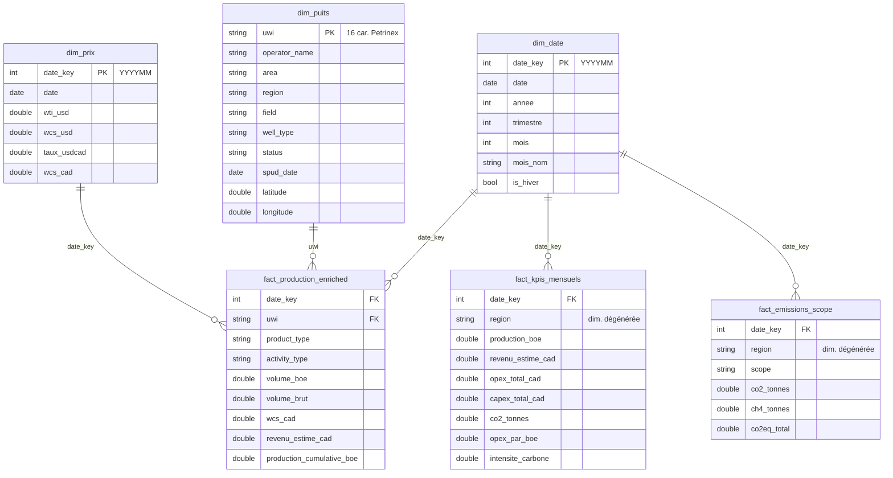

# Documentation technique — Alberta Energy Operations Intelligence

> Document de référence complet pour comprendre **l'intégralité du projet** :
> architecture, chaque script Python (rôle, entrées/sorties, fonctions, logique
> métier), le projet dbt, la base DuckDB, les conventions et les décisions de
> conception. Destiné autant à un relecteur technique qu'à toi-même dans 6 mois.

---

## Table des matières

1. [Vue d'ensemble et flux de données](#1-vue-densemble-et-flux-de-données)
2. [Conventions transverses](#2-conventions-transverses)
3. [Script 01 — Ingestion Petrinex](#3-script-01--ingestion-petrinex)
4. [Script 02 — Dimension puits (ST37)](#4-script-02--dimension-puits-st37)
5. [Script 03 — Dimension prix](#5-script-03--dimension-prix)
6. [Script 04 — Coûts simulés](#6-script-04--coûts-simulés)
7. [Script 05 — Émissions ESG](#7-script-05--émissions-esg)
8. [Projet dbt (DuckDB)](#8-projet-dbt-duckdb)
9. [Base DuckDB et tables finales](#9-base-duckdb-et-tables-finales)
10. [Données de référence et fichiers bruts](#10-données-de-référence-et-fichiers-bruts)
11. [Exécution de bout en bout](#11-exécution-de-bout-en-bout)
12. [Décisions de conception et écarts](#12-décisions-de-conception-et-écarts)
13. [Glossaire O&G](#13-glossaire-og)

---

## 1. Vue d'ensemble et flux de données

Le projet reconstruit la chaîne analytique d'un opérateur **upstream Oil & Gas** en
Alberta : de la donnée réglementaire brute jusqu'à un modèle en étoile prêt pour
Power BI.

```
 SOURCES PUBLIQUES                INGESTION PYTHON              TRANSFORMATION         RESTITUTION
 ─────────────────                ────────────────              ──────────────         ───────────
 Petrinex Volumetric ──▶ 01_ingest_petrinex.py  ─▶ petrinex24.parquet ─┐
 AER ST37 + réf. BA/Field ─▶ 02_ingest_aer_wells.py ─▶ dim_puits.parquet ─┤
 Yahoo Finance + BoC ──▶ 03_ingest_prices.py    ─▶ dim_prix.parquet  ─┼─▶ dbt + DuckDB ─▶ Power BI
 (volumes réels) ──────▶ 04_generate_costs.py   ─▶ fact_couts.parquet ─┤   (staging→marts)   (.pbix)
 (volumes réels) ──────▶ 05_generate_emissions.py ▶ fact_emissions.parquet ┘
```

**Trois couches :**

| Couche | Outil | Rôle | Emplacement |
|---|---|---|---|
| Ingestion | Python (pandas/numpy) | Télécharger, nettoyer, simuler → Parquet + CSV | `scripts/` → `data/processed/` |
| Transformation | dbt Core + DuckDB | staging (typage) → marts (étoile), tests, lineage | `dbt_project/` → `data/energy.duckdb` |
| Restitution | Power BI Desktop | mesures DAX, RLS, visuels | `powerbi/` |

**Ordre de dépendance obligatoire** (chaque étape lit la sortie des précédentes) :

```
01 ─▶ 02 ─▶ 03 ─▶ 04 ─▶ 05 ─▶ dbt build
        │            ▲    ▲
        └────────────┘    │  (04 lit petrinex24 + dim_puits)
        (02,03 indép. de 04/05 ; 04 et 05 lisent petrinex24 ; 04 lit aussi dim_puits)
```

---

## 2. Conventions transverses

Ces règles s'appliquent à **tous** les scripts (issues de `CLAUDE.md`).

- **Ancrage des chemins** : chaque script calcule
  `ROOT = Path(__file__).resolve().parent.parent`. Aucun chemin absolu en dur ;
  les scripts marchent quel que soit le répertoire de lancement.
- **`data/raw/`** : fichiers sources bruts, **manuels et gitignorés**. Les scripts
  n'y écrivent jamais.
- **`data/processed/`** : sorties générées, en **Parquet** (analyse) **et CSV**
  (portabilité/inspection). Gitignorés.
- **snake_case** partout (colonnes Python et SQL).
- **Vectorisation** : les conversions conditionnelles utilisent `numpy.select()`
  (jamais `apply()`), pour rester en O(n).
- **Compatibilité PyArrow** : les colonnes catégorielles sont converties en `str`
  avant l'export Parquet.
- **Encodage console** : les scripts 02 et 03 forcent
  `sys.stdout.reconfigure(encoding="utf-8")` pour éviter un `UnicodeEncodeError`
  sur la console Windows (cp1252) avec des caractères comme `∩` ou `é`.

---

## 3. Script 01 — Ingestion Petrinex

**Fichier** : `scripts/01_ingest_petrinex.py`
**Sorties** : `data/processed/petrinex24.parquet` + `petrinex24.csv`
**Source** : API publique Petrinex (volumétrie conventionnelle AB)
`https://www.petrinex.gov.ab.ca/publicdata/API/Files/AB/Vol/{YYYY-MM}/CSV`

### 3.1 Rôle

Télécharger 24 mois de déclarations de production, les nettoyer, convertir les
volumes m³ → BOE, et produire la table de faits de production de base
(~7,2 M de lignes après nettoyage).

### 3.2 Constantes clés

| Constante | Valeur | Signification |
|---|---|---|
| `MONTHS_BACK` | 24 | nombre de mois glissants |
| `PUBLISH_LAG` | 2 | Petrinex publie avec ~2 mois de retard |
| `MAX_WORKERS` | 6 | téléchargements réseau simultanés |
| `COLUMN_MAPPING` | dict | renommage colonnes Petrinex → snake_case |
| `KEEP_PRODUCTS` | OIL, GAS, WATER, COND | produits conservés |
| `KEEP_ACTIVITIES` | PROD, SHUTIN, FUEL, VENT | activités conservées |
| `BOE_LIQUID` | 6.29 | 1 m³ liquide = 6,29 BOE |
| `BOE_GAS` | 35.31/6000 | 1 m³ gaz ≈ 0,005885 BOE |

### 3.3 Fonctions / méthodes

- **`build_month_list(months_back, lag)`** — génère la liste des `YYYY-MM` à
  télécharger en O(n) à partir de la date courante (premier du mois) décalée du lag.
- **`fetch_month(month_str)`** — pour un mois : requête HTTP → **double dézip**
  (Petrinex emballe un zip dans un zip → CSV), parse en mémoire, sélectionne et
  renomme les colonnes utiles, type `volume_brut` (float) et `date` (datetime).
  Retourne `(mois, DataFrame|None, message_log)`. Gère `BadZipFile` et HTTP ≠ 200.
- **`download_parallel(months)`** — `ThreadPoolExecutor(MAX_WORKERS)` lance les
  `fetch_month` en parallèle, concatène chronologiquement, puis convertit les codes
  texte en `category` (gain RAM ~60 %).
- **`filter_quality(df)`** — applique les **4 filtres** dans l'ordre : (a) `uwi` non
  nul, (b) `product_type` ∈ KEEP_PRODUCTS, (c) `activity_type` ∈ KEEP_ACTIVITIES,
  (d) `volume_brut ≥ 0` (élimine les corrections rétroactives négatives). Affiche le
  décompte à chaque étape.
- **`convert_to_boe(df)`** — calcule `volume_boe` via `np.select` :
  OIL/COND × 6.29, GAS × (35.31/6000), WATER = 0. Affiche un récapitulatif par produit.
- **`save_parquet(df)`** — convertit les `category` en `str`, écrit le Parquet
  (Snappy) **et le CSV**.
- **`quality_report(df_brut, df_clean)`** — rapport final : lignes brutes/propres,
  plage temporelle, UWI/opérateurs uniques, volumes BOE par produit, top 10
  opérateurs, contrôle des nulls et des volumes négatifs, dtypes finaux.

### 3.4 Colonnes de sortie

`operator_id` · `uwi` · `date` · `product_type` · `activity_type` · `volume_brut` · `volume_boe`

---

## 4. Script 02 — Dimension puits (ST37)

**Fichier** : `scripts/02_ingest_aer_wells.py`
**Sorties** : `data/processed/dim_puits.parquet` + `dim_puits.csv`
**Sources** (dans `data/raw/`) :
- `ST37.zip` — AER « List of Wells in Alberta » (TXT tabulé, 24 colonnes, ~661 k lignes)
- `ba_codes.csv` — Petrinex Business Associate : code BA → nom
- `field_codes.csv` — Petrinex Field Codes : code champ → nom

### 4.1 Rôle et difficulté

Construire la dimension puits (clé `uwi`) avec géolocalisation. **Le ST37 réel ne
correspond pas au format Excel attendu initialement** : c'est un fichier texte
tabulé, sans latitude/longitude (localisation **DLS** : Township/Range/Méridien),
avec des **codes** plutôt que des noms. Le script reconstruit donc tout ce qui manque.

### 4.2 Constantes clés

| Constante | Rôle |
|---|---|
| `ST37_COLUMNS` | les 24 noms de colonnes du TXT, dans l'ordre du layout AER |
| `UWI_DISPLAY_RE` | regex pour parser l'UWI affiché `00/06-06-001-01W4/0` |
| `MER_BASE_LON` | longitude de base par méridien (W2=−102 … W6=−118) |
| `TWP_HEIGHT_DEG` | 6 mi ≈ 0,08685° de latitude par township |
| `STATUS_MAP` | MODE_SHORT_DESCRIPTION → ACTIVE / SUSPENDED / ABANDONED |

### 4.3 Fonctions / méthodes

- **`_boustrophedon_col_from_west(idx, n)`** — les sections (1‑36) et LSD (1‑16)
  d'un township sont numérotés **en serpentin** (rangée paire E→O, impaire O→E).
  Cette fonction renvoie la position « depuis l'ouest » d'une cellule, nécessaire
  pour situer un puits dans le township.
- **`dls_to_latlon(twp, rge, mer, sec, lsd)`** — **conversion géographique** :
  calcule la fraction nord (depuis le 49ᵉ parallèle) et ouest (depuis le méridien)
  du centroïde de la LSD, puis :
  - `lat = 49.0 + ((twp − 1) + fraction_nord) × TWP_HEIGHT_DEG`
  - largeur d'un range = `6 / (69.172 × cos(lat))` (corrigée de la latitude)
  - `lon = longitude_méridien − ((rge − 1) + fraction_ouest) × largeur_range`
  Vectorisé ; renvoie NaN si méridien inconnu. Précision ~niveau section/LSD,
  suffisante pour une carte.
- **`read_st37()`** — dézippe et lit le `WellList.txt` (`sep="\t"`, `latin-1`,
  `quoting=QUOTE_NONE`), applique les 24 noms de colonnes, `.strip()` partout.
- **`report_uwi_coverage(dim)`** — calcule le **taux de couverture** :
  `|UWI communs| / |UWI petrinex24| × 100` (résultat obtenu : **91,76 %**, cible > 70 %).
- **`main()`** — orchestration (voir 4.4).

### 4.4 Logique de `main()` (étapes)

1. **Parsing DLS** : `UWI_DISPLAY_RE` extrait exception, LSD, section, township,
   range, méridien, event depuis l'UWI affiché. Les lignes non‑DLS sont rejetées.
2. **Reconstruction de la clé `uwi`** (16 caractères, format Petrinex) :
   `"1" + exc + lsd + sec + twp + rge + mer + event(2 chiffres)`.
   Exemple : `00/01-02-065-04W4/0` → `100010206504W400` — identique à la clé Petrinex.
3. **Jointures codes → noms** :
   - `operator_name` = `LICENSEE-CODE[:4]` mappé sur `ba_codes` (le 5ᵉ caractère est
     un suffixe ; les 4 premiers matchent les BA à 100 %), avec repli sur OPERATOR-CODE.
   - `field` = `FIELD-CODE` (4 chiffres) mappé sur `field_codes`.
4. **Coordonnées** : appel à `dls_to_latlon`.
5. **region / area** (le ST37 n'a pas de champ « area ») :
   - `region` via `np.select` : Peace River (W6 ou W5 township ≥ 78), Nord (twp ≥ 56),
     Central (twp ≥ 31), sinon Sud.
   - `area` = libellé dérivé du méridien (ex. « Plaines (W4) »), distinct de region.
6. **status / well_type / spud_date** : `STATUS_MAP`, `TYPE_SHORT_DESCRIPTION`
   (« N/A » → null), `FIN-DRL-DATE` (libération du rig ≈ forage) parsé en date.
7. **Nettoyage** : `uwi` au bon format, lat/lon dans les bornes de l'Alberta
   (48,9–60,1 N ; −120,2 à −109,8 W), dédoublonnage sur `uwi`.
8. **Export** Parquet + CSV, puis rapport qualité + couverture.

### 4.5 Colonnes de sortie

`uwi` · `operator_name` · `area` · `region` · `field` · `well_type` · `status` · `spud_date` · `latitude` · `longitude`

---

## 5. Script 03 — Dimension prix

**Fichier** : `scripts/03_ingest_prices.py`
**Sorties** : `data/processed/dim_prix.parquet` + `dim_prix.csv`
**Sources (sans clé API)** :
- **WTI** : Yahoo Finance, contrat `CL=F` (`.../v8/finance/chart/CL=F`)
- **USD/CAD** : Banque du Canada, série `FXUSDCAD` (API Valet)

### 5.1 Rôle

Produire un prix de référence **WCS en CAD** par mois, aligné sur la fenêtre des
24 mois Petrinex, pour valoriser la production.

### 5.2 Constantes clés

| Constante | Valeur | Rôle |
|---|---|---|
| `WCS_DISCOUNT_USD` | 17.5 | décote historique moyenne WCS vs WTI (USD/bbl) |
| `YAHOO_WTI_URL` / `BOC_FX_URL` | — | endpoints sources |

### 5.3 Fonctions / méthodes

- **`month_window()`** — détermine la fenêtre (premier/dernier mois). Si
  `petrinex24.parquet` existe, **s'aligne sur ses dates réelles** ; sinon calcule
  24 mois en arrière avec le lag.
- **`fetch_wti()`** — appelle Yahoo (`interval=1mo`, `range=5y`), parse
  `timestamp` + `close`, ramène chaque date au 1er du mois.
- **`fetch_usdcad(first)`** — appelle la Banque du Canada (taux quotidiens),
  **moyenne par mois** pour obtenir un taux mensuel.
- **`main()`** — construit une **grille mensuelle complète** sur la fenêtre, joint
  WTI et FX, comble les trous (`interpolate` + `ffill`/`bfill`), puis calcule :
  - `wcs_usd = wti_usd − 17.5`
  - `wcs_cad = wcs_usd × taux_usdcad`
  - `date_key = YYYYMM`
  Valide enfin : `wcs_usd > 0`, taux ∈ [1,20 ; 1,50], absence de nulls (avertissements).

### 5.4 Colonnes de sortie

`date_key` · `date` · `wti_usd` · `wcs_usd` · `taux_usdcad` · `wcs_cad`

---

## 6. Script 04 — Coûts simulés

**Fichier** : `scripts/04_generate_costs.py`
**Sorties** : `data/processed/fact_couts.parquet` + `fact_couts.csv`
**Lit** : `petrinex24.parquet` (volumes) **et** `dim_puits.parquet` (spud_date)

> ⚠️ **Données simulées** — fourchettes calées sur l'*AER Annual Report 2023*. Ce
> n'est pas une donnée réelle, mais une modélisation cohérente avec la réalité O&G.

### 6.1 Rôle

Générer des coûts opératoires (OPEX) et d'investissement (CAPEX) par puits et par
mois, **proportionnels aux volumes BOE réels** produits.

### 6.2 Paramètres de simulation

| Constante | Valeur | Effet |
|---|---|---|
| `RNG_SEED` | 42 | reproductibilité (générateur numpy) |
| `OPEX_FORAGE_MU / SIGMA` | 12 / 2 | tarif forage $/boe ~ Normal |
| `OPEX_MAINT_MU / SIGMA` | 4 / 1.5 | tarif maintenance $/boe ~ Normal |
| `CAPEX_LOGNORM_MEAN / SIGMA` | 11.5 / 0.6 | CAPEX ~ log‑normale (CAD) |
| `CAPEX_RECENT_MULT` | 2.5 | majoration CAPEX puits < 3 ans |
| `WINTER_MULT` | 1.15 | OPEX × 1,15 en jan/fév/mars (coûts hivernaux) |
| `INCIDENT_RATE / MULT` | 0.05 / 2.0 | 5 % des puits/mois en incident → OPEX × 2 |

### 6.3 Logique de `main()`

1. Agréger les volumes BOE par `(uwi, date)` depuis Petrinex (production > 0).
2. Tarifs OPEX forage et maintenance tirés de lois Normales, **tronqués ≥ 0**.
3. **Saisonnalité** (`np.select`) : × 1,15 si le mois ∈ {1,2,3}.
4. **Incidents** : tirage aléatoire, 5 % des couples → multiplicateur × 2.
5. `opex_forage = tarif × multiplicateurs × volume_boe` (idem maintenance).
6. **CAPEX** : base log‑normale × 2,5 si l'âge du puits (`date − spud_date`) < 3 ans.
7. `devise = "CAD"`. Contrôle qualité : percentiles OPEX/boe (cible 8–30 $/boe ;
   obtenu : p05 12,2 / médiane 16,7 / p95 24,9).

### 6.4 Colonnes de sortie

`uwi` · `date_key` · `opex_forage` · `opex_maintenance` · `capex` · `devise`

---

## 7. Script 05 — Émissions ESG

**Fichier** : `scripts/05_generate_emissions.py`
**Sorties** : `data/processed/fact_emissions.parquet` + `fact_emissions.csv`
**Lit** : `petrinex24.parquet`

> ⚠️ **Calcul ESG simulé** — facteurs issus de l'*Inventaire National des GES du
> Canada (NIR 2024)*, appliqués aux volumes BOE réels.
>
> **Calage réalité (juin 2026)** — facteurs ajustés aux totaux publiés, sans
> inventer de donnée par puits :
> - CO₂ Scope 1 ≈ **105 Mt/an**, CH₄ ≈ **1,2 Mt/an**, CO₂eq ≈ **139 Mt/an** —
>   cohérent avec le total O&G amont de l'Alberta. (Avant calage : CH₄ 7,7 Mt/an,
>   CO₂eq 297 Mt/an, qui dépassait le total provincial.)
> - **Périmètre = puits Petrinex.** Le bitume **miné** des sables (~1,3 Mbbl/j,
>   non déclaré par puits) est hors champ : c'est normal, pas un sous-comptage.
> - **Marge opérationnelle = opex-only** (hors redevances/transport/G&A,
>   indisponibles par puits). À lire comme marge opératoire, **pas** rentabilité nette.

### 7.1 Facteurs

| Constante | Valeur | Signification |
|---|---|---|
| `FACTEUR_CO2_BOE` | 0.055 | t CO₂ / BOE (upstream O&G Alberta) — total ~105 Mt CO₂/an |
| `FACTEUR_CH4_BOE` | 0.000625 | t CH₄ / BOE — **calibré** sur ~1,2 Mt CH₄/an (réf. base NIR/AER 2014 ≈ 31,4 Mt CO₂e ÷ 25). Ancien 0.004 = ~6× trop |
| `CO2EQ_CH4` | 28 | PRG100 du CH₄ (GIEC AR6 ; ~AR5) → CO₂eq |
| `VARIANCE_PUITS` | 0.10 | variance inter‑puits ±10 % |
| `SCOPE` | "Scope1" | émissions directes upstream |

### 7.2 Logique de `main()`

1. Agréger les volumes BOE par `(uwi, date)` (production > 0).
2. Tirer un facteur de variance `1 ± 10 %` par ligne.
3. `co2_tonnes = volume_boe × 0.055 × variance` ; `ch4_tonnes` idem avec 0.000625.
4. `co2eq_total = co2_tonnes + ch4_tonnes × 28`.
5. Contrôle : intensité globale `Σco2 / Σboe` doit ≈ 0,055 (obtenu : **0,0550**).

### 7.3 Colonnes de sortie

`uwi` · `date_key` · `co2_tonnes` · `ch4_tonnes` · `co2eq_total` · `scope`

---

## 8. Projet dbt (DuckDB)

**Emplacement** : `dbt_project/energy_analytics/`
**Profil** : DuckDB, base `data/energy.duckdb` (chemins relatifs ; lancer dbt depuis
le dossier du projet avec `--profiles-dir .`).

### 8.1 Configuration

- **`dbt_project.yml`** : `staging` matérialisé en **vues**, `marts` en **tables**.
- **`profiles.yml`** *(gitignoré, ne pas commiter)* : `type: duckdb`,
  `path: "../../data/energy.duckdb"`, `threads: 4`.
- **`models/sources.yml`** : source `raw` exposant les 5 Parquet via la fonctionnalité
  dbt‑duckdb `external_location: "../../data/processed/{name}.parquet"` (le `{name}`
  est remplacé par le nom de la table). Ainsi `{{ source('raw','petrinex24') }}` lit
  directement le Parquet.

### 8.2 Modèles staging (vues — typage / normalisation)

| Modèle | Source | Rôle |
|---|---|---|
| `stg_petrinex_production` | `raw.petrinex24` | typage + ajout `date_key` (YYYYMM) |
| `stg_aer_wells` | `raw.dim_puits` | cast `spud_date` en date |
| `stg_eia_prices` | `raw.dim_prix` | pass‑through typé |
| `stg_costs` | `raw.fact_couts` | ajoute `opex_total = forage + maintenance` |
| `stg_emissions` | `raw.fact_emissions` | pass‑through typé |

### 8.3 Modèles marts (tables — schéma étoile)

| Modèle | Grain | Contenu |
|---|---|---|
| `dim_date` | mois | spine mensuel (24 mois) : `date_key`, `date`, `annee`, `trimestre`, `mois`, `mois_nom`, `is_hiver` (généré via `generate_series`) |
| `dim_puits` | puits | dimension puits (passe‑plat staging) |
| `fact_production_enriched` | ligne de prod. | production + `wcs_cad` (LEFT JOIN prix) + `revenu_estime_cad` + `production_cumulative_boe` (fenêtre SUM OVER par uwi) |
| `fact_kpis_mensuels` | mois × région | agrégats : production, revenu, OPEX, CAPEX, CO₂, `opex_par_boe`, `intensite_carbone` (joint prod./coûts/émissions sur uwi+date_key, puis région via dim_puits) |
| `fact_emissions_scope` | mois × région × scope | CO₂/CH₄/CO₂eq agrégés |

### 8.4 Tests (`schema.yml`)

- **staging** : `not_null` (uwi, date_key, volume_boe, lat/lon…), `unique`
  (`dim_puits.uwi`, `dim_prix.date_key`), `accepted_values` (product_type,
  activity_type, scope).
- **marts** : `unique` (`dim_date.date_key`, `dim_puits.uwi`), `not_null` sur les
  clés, et **`relationships`** `fact_production_enriched.uwi → dim_puits.uwi` en
  **`severity: warn`** (≈ 8 % d'UWI orphelins = couverture ST37 imparfaite + UWI de
  facilité 7 caractères ; volontairement non bloquant).

### 8.5 Résultat

`dbt build` → **PASS 37 / WARN 1 / ERROR 0**.
`dbt docs generate` → lineage copié dans `docs/dbt/` (pour GitHub Pages).

---

## 9. Base DuckDB et tables finales

Fichier : `data/energy.duckdb` (gitignoré). Contenu après `dbt build` :

```
BASE TABLE  dim_date
BASE TABLE  dim_puits
BASE TABLE  fact_production_enriched
BASE TABLE  fact_kpis_mensuels
BASE TABLE  fact_emissions_scope
VIEW        stg_aer_wells | stg_costs | stg_eia_prices | stg_emissions | stg_petrinex_production
```

**Relations en étoile** (côté Power BI) : les faits se joignent à `dim_puits` (via
`uwi`), `dim_date` et `dim_prix` (via `date_key`). Toutes les relations sont 1‑à‑N,
filtre du dim vers le fait.

**Repères de cohérence** : production mensuelle ~75–83 Mboe, OPEX/boe 16–19 $,
intensité carbone 0,055, revenu PROD cumulé ~137,9 G$ CAD.

### 9.1 Diagramme du modèle en étoile (ERD)

Trois tables de faits gravitent autour de trois dimensions partagées. `dim_date` et
`dim_prix` se branchent par `date_key` ; `dim_puits` par `uwi`. `region` est une
**dimension dégénérée** portée par les faits agrégés (pas de table séparée).



**Vue schématique (étoile)** — repli si le rendu Mermaid n'est pas disponible :

```
                             ┌──────────────────────────┐
                             │         dim_date         │
                             │  🔑 date_key  (PK YYYYMM) │
                             │  date · annee · trimestre │
                             │  mois · mois_nom · is_hiver│
                             └─────────────┬────────────┘
                                           │ 1
                  ┌────────────────────────┼────────────────────────┐
                  │ N                      │ N                       │ N
   ┌──────────────┴─────────────┐  ┌───────┴───────────┐  ┌──────────┴──────────┐
   │ fact_production_enriched   │  │ fact_kpis_mensuels│  │ fact_emissions_scope│
   │ (grain : ligne de prod.)   │  │ (date_key×région) │  │(date_key×région×scope)│
   │────────────────────────────│  │───────────────────│  │─────────────────────│
   │ 🔗 date_key  → dim_date     │  │ 🔗 date_key        │  │ 🔗 date_key          │
   │ 🔗 uwi       → dim_puits    │  │    region (dégén.)│  │    region (dégén.)  │
   │ 🔗 date_key  → dim_prix     │  │    production_boe │  │    scope            │
   │    product/activity_type   │  │    revenu_estime  │  │    co2_tonnes       │
   │    volume_boe · volume_brut│  │    opex_total_cad │  │    ch4_tonnes       │
   │    wcs_cad                  │  │    capex_total_cad│  │    co2eq_total      │
   │    revenu_estime_cad        │  │    co2_tonnes     │  └─────────────────────┘
   │    production_cumulative_boe│  │    opex_par_boe   │
   └───────┬──────────────┬─────┘  │    intensite_carb.│
           │ N            │ N      └───────────────────┘
   uwi     │              │  date_key
   ┌───────┴──────────┐   └──────────────┐
   │    dim_puits     │                  │ N
   │ 🔑 uwi  (PK)      │          ┌───────┴───────────┐
   │  operator_name   │          │     dim_prix      │
   │  area · region   │          │ 🔑 date_key (PK)   │
   │  field · well_type│         │  date · wti_usd   │
   │  status          │          │  wcs_usd          │
   │  spud_date       │          │  taux_usdcad      │
   │  latitude/longit.│          │  wcs_cad          │
   └──────────────────┘          └───────────────────┘

   🔑 = clé primaire (dimension)    🔗 = clé étrangère (fait)
   Cardinalité : 1 (dimension) ──< N (fait) ; sens du filtre : dim → fait.
```

> **Notes de modélisation**
> - `fact_production_enriched` est la table de faits **détaillée** (un enregistrement
>   par ligne de production Petrinex) ; les deux autres sont **pré-agrégées** pour les
>   pages KPI et ESG (perf. Power BI).
> - `dim_prix` provient du staging (`stg_eia_prices`) : elle n'est pas matérialisée en
>   mart mais s'expose à Power BI comme dimension date-prix (clé `date_key`).
> - `region` n'a pas de table : c'est une **dimension dégénérée** stockée dans les faits
>   agrégés, héritée de `dim_puits.region` au moment de l'agrégation dbt.

---

## 10. Données de référence et fichiers bruts

Déposés dans `data/raw/` (gitignorés ; récupérés depuis des sources publiques) :

| Fichier | Source | Usage |
|---|---|---|
| `Vol_YYYY-MM-AB.*` | Petrinex API | volumétrie mensuelle (script 01) |
| `ST37.zip` (`WellList.txt`) | `static.aer.ca/.../st37/ST37.zip` | registre des puits (script 02) |
| `St37-layout.pdf` | AER | spécification du format TXT (positions, codes) |
| `ba_codes.csv` | `petrinex.gov.ab.ca/bbreports/PRABAIdentifiers.csv` | code BA → nom opérateur |
| `field_codes.csv` | `petrinex.gov.ab.ca/bbreports/PRAFieldCodes.csv` | code champ → nom |

**Format du ST37 TXT** (résumé du layout) : 24 colonnes **tabulées**, dont
`UWI-DISPLAY-FORMAT`, localisation DLS (Township/Méridien/Range/Section/LSD),
`WELL-NAME`, `FIELD-CODE`, `LICENSEE-CODE`, `OPERATOR-CODE`, `FIN-DRL-DATE`,
`MODE_SHORT_DESCRIPTION` (statut), `TYPE_SHORT_DESCRIPTION` (usage). Pas de lat/lon
(d'où la conversion DLS du script 02).

---

## 11. Exécution de bout en bout

```powershell
# Environnement
python -m venv .venv
.\.venv\Scripts\Activate.ps1
pip install -r requirements.txt

# Déposer dans data/raw/ : ST37.zip, ba_codes.csv, field_codes.csv (URLs §10)

# Pipeline Python (ordre impératif)
python scripts\01_ingest_petrinex.py     # ~13 M lignes brutes -> 7,2 M propres
python scripts\02_ingest_aer_wells.py     # dim_puits (couverture UWI ~92 %)
python scripts\03_ingest_prices.py        # WTI + USD/CAD -> WCS CAD (réseau requis)
python scripts\04_generate_costs.py       # OPEX/CAPEX (lit petrinex + dim_puits)
python scripts\05_generate_emissions.py   # émissions Scope 1

# Transformation dbt (depuis le dossier du projet dbt)
cd dbt_project\energy_analytics
dbt build --profiles-dir .                # 5 marts + 5 vues + tests
dbt docs generate --profiles-dir .        # lineage -> target/ (copié dans docs/dbt)

# Power BI : ouvrir powerbi\alberta_energy_bi.pbix, connecter energy.duckdb, rafraîchir
```

---

## 12. Décisions de conception et écarts

Écarts assumés vs spécification initiale (`CLAUDE.md`), avec justification :

| Point | Spéc. initiale | Réalité / choix | Pourquoi |
|---|---|---|---|
| Nom du Parquet Petrinex | `petrinex24.parquet` | aligné (renommé) | cohérence avec la norme documentée |
| Source ST37 | Excel `aer_wells.xlsx` | **TXT tabulé `ST37.zip`** | l'AER ne publie pas d'Excel |
| latitude/longitude | colonnes du ST37 | **converties depuis le DLS** | absentes du TXT ; évite d'installer geopandas |
| operator_name / field | noms dans le ST37 | **jointures référentiels Petrinex** | le ST37 ne contient que des codes |
| Prix WTI / FX | EIA + Alpha Vantage | **Yahoo Finance + Banque du Canada** | EIA/Alpha Vantage exigent des clés API |
| Test relationnel | bloquant | **`warn`** | couverture ST37 ~92 % (orphelins normaux) |
| dbt | — | upgrade `typing_extensions` | conflit de dépendances dans le venv |

**Principes conservés :** données réelles et publiques pour les volumes/prix/puits ;
conversion BOE standard AER ; WCS = WTI − 17,5 ; coûts/émissions simulés mais calés
sur des références officielles ; aucun chemin absolu en dur ; vectorisation numpy.

---

## 13. Glossaire O&G

| Terme | Définition |
|---|---|
| **BOE** | Baril équivalent pétrole — unité d'énergie commune (liquides et gaz). |
| **UWI** | Unique Well Identifier — identifiant normalisé d'un événement de puits. |
| **DLS** | Dominion Land Survey — grille de localisation des Prairies (Township/Range/Méridien/Section/LSD). |
| **WTI** | West Texas Intermediate — prix de référence du brut nord‑américain. |
| **WCS** | Western Canadian Select — brut lourd albertain, vendu avec décote vs WTI. |
| **OPEX / CAPEX** | Coûts d'exploitation / d'investissement. |
| **Scope 1** | Émissions directes de GES d'une installation. |
| **Upstream** | Segment exploration‑production (vs midstream/downstream). |
| **AER** | Alberta Energy Regulator — régulateur provincial. |
| **Petrinex** | Système d'enregistrement pétrolier (AB/SK/BC/MB). |
| **ST37** | Rapport AER « List of Wells in Alberta ». |
| **Spud** | Démarrage du forage d'un puits. |

---

*Document généré pour le projet portfolio Data Analyst — Calgary 2026.*
